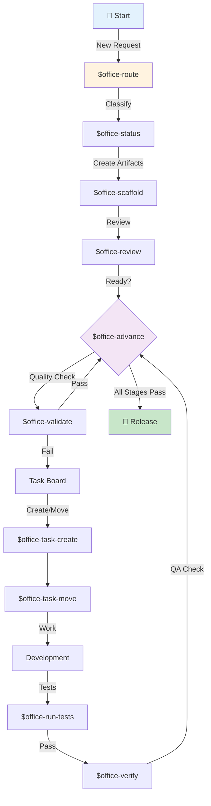
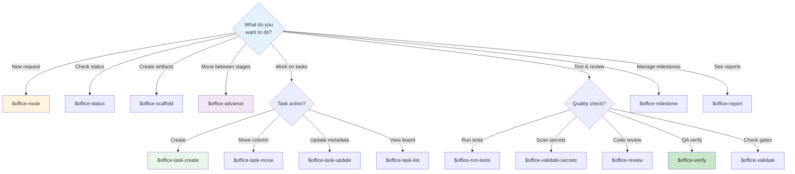
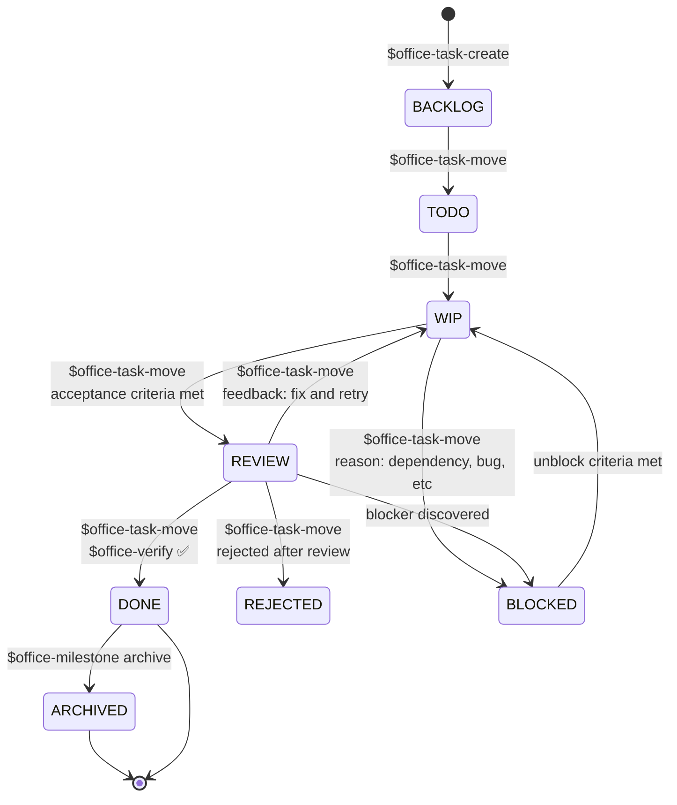
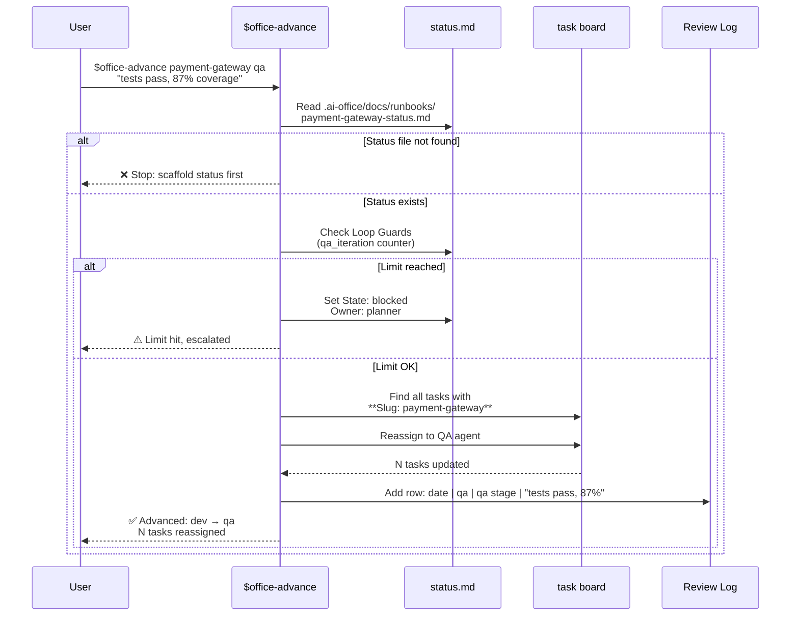
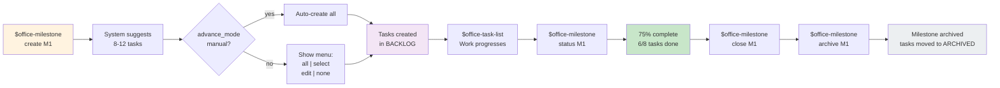
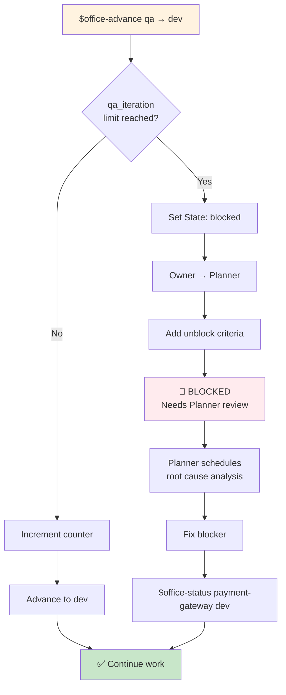

# AI Office — Multi-Agent Software Development Framework

A file-based virtual agency system for AI-assisted software development. AI Office now ships as a host-neutral core plus thin adapters for Codex, Windsurf, Claude Code, OpenCode, or a base markdown+CLI workflow, with a single adapter source of truth in the neutral manifest plus shared command templates rendered on demand during install and update.

## 🎯 What It Does

**AI Office** manages the complete software development lifecycle:

- 📋 **Pipeline stages**: discussion → requirements → architecture → planning → implementation → QA → review → UAT → release → postmortem
- 👥 **22 specialized agents**: PM, architect, developer, designer, QA, security, reviewer, ops, and more
- 🗂️ **9 pre-built agencies**: software, startup, game, creative, media, security, legal, CAD, and crypto trading workflows
- 📊 **Kanban board**: backlog, TODO, WIP, review, blocked, rejected, done, archived
- 🎯 **Milestone tracking**: auto-suggest tasks, measure velocity, track progress
- 🛡️ **Loop guards**: prevent infinite QA/review/UAT cycles (hard limits with escalation)
- 📝 **Artifacts**: PRD, ADR, runbooks, task board, status files—all markdown, all version-controlled

### Visual Overview


---

## 🚀 Quick Start

### 1. Install

Pick the adapter that matches your preferred host:

```bash
# Codex
./install.sh [project-root] --adapter=codex

# Windsurf
./install.sh [project-root] --adapter=windsurf

# Claude Code
./install.sh [project-root] --adapter=claude-code

# OpenCode
./install.sh [project-root] --adapter=opencode

# Base markdown + CLI workflow
./install.sh [project-root] --adapter=base

# Add --skip-setup if you only want to install the files
```

The installer creates:
- `AI-OFFICE.md` — host-neutral operating contract
- `.ai-office/` — framework engine (agents, agencies, configs, task board)
- Adapter-specific wrapper files such as `AGENTS.md` + `.codex/skills/`, `AGENTS.md` + `.windsurf/rules/` + `.windsurf/workflows/`, `CLAUDE.md` + `.claude/skills/`, or `opencode.json` + `.opencode/commands/`

In an interactive terminal, `install.sh` now launches the setup wizard automatically after the files are installed. If the install is running non-interactively, or you pass `--skip-setup`, run `./setup.sh [project-root]` yourself afterward.

Those adapter wrapper files are generated at install/update time from the neutral manifest and shared templates rather than copied from committed adapter bundles.

### 2. Configure

```bash
# If setup did not auto-launch, start the interactive wizard manually
./setup.sh .

# Or automatic with flags
./setup.sh . --agency=software-studio --stack=node-react --non-interactive

# Reconfigure an existing project.config.md from the terminal
./setup.sh . --reconfigure --stack=node-react --advance-mode=auto
```

Adapter-specific setup shortcuts can wrap the same flow, but `setup.sh` is the neutral baseline.

### 3. Start a Feature

Examples below use the Codex adapter syntax:

```bash
$office-route Add user profile editing

# Creates discussion context, asks clarifying questions,
# suggests pipeline path, recommends first action
```

### 4. Use the Deterministic CLI

```bash
./bin/ai-office doctor
./bin/ai-office task create "Implement billing sync" priority:HIGH column:TODO assignee:Developer
./bin/ai-office task update M0_T001 labels:billing,backend estimate:3h
./bin/ai-office task move M0_T001 WIP "started implementation"
./bin/ai-office milestone create M1 "Billing Sync" target:2026-05-01 tasks:yes
./bin/ai-office milestone status M1
./bin/ai-office status set billing-sync dev Developer "Implementation started"
./bin/ai-office validate billing-sync prd
```

Use the CLI for state mutations and let your chosen adapter orchestrate the higher-level workflow around it.

### 5. Regenerate Adapter Preview Outputs

```bash
bun run build:adapters
```

This rebuilds maintainer preview outputs from the neutral sources in `src/adapter-manifest.ts` and `skeleton/core/templates/`.

This step is mainly for framework maintainers. Projects consuming AI Office do not need to run it during normal usage because `install.sh` and `update.sh` generate the selected adapter on demand. The generated preview files are not part of the normal committed repo state.

---

## 📚 Table of Contents

- [Commands Reference](#commands-reference)
- [What's New in v1.13.0](#whats-new-in-v1130)
- [Directory Structure](#directory-structure)
- [Task Management](#task-management)
- [Pipeline & Stages](#pipeline--stages)
- [Milestone Workflow](#milestone-workflow)
- [Loop Guards](#loop-guards)
- [Agencies](#agencies)
- [Project Configuration](#project-configuration)
- [Host Adapters](#-host-adapters)
- [Updating](#updating)

---

## 📋 Commands Reference

### Command Flow Diagram

Examples below use Codex shortcut syntax. Windsurf, Claude Code, and OpenCode use slash workflows or commands through their adapters, and the base adapter can call the `ai-office` CLI directly.



### Which Command Should I Use?



### Core Routing

| Command | Purpose |
|---------|---------|
| `$office` | **Start here.** Interactive wizard to discover and execute commands step-by-step |
| `$office-route <request>` | Classify request type, run discussion phase, suggest pipeline path, create context |
| `$office-status <slug> [state] [owner] [notes]` | Get current pipeline status or update it |

### Pipeline Management

| Command | Purpose |
|---------|---------|
| `$office-advance <slug> <evidence> [next-stage]` | Advance to next stage, reassign tasks, check loop guards |
| `$office-validate <slug> <stage>` | Validate quality gates before advancing |
| `$office-scaffold <slug> <stage>` | Create artifact (discuss, prd, adr, plan, tasks, status, review, runbook) |

### Task Board

| Command | Purpose |
|---------|---------|
| `$office-task-create <title> [ms:M1] [priority:HIGH] [column:BACKLOG] [assignee:Developer] [estimate:4h] [labels:bug,auth] [slug:feature]` | Create new task with optional slug linking |
| `$office-task-move <task-id> <column> [reason]` | Move task (BACKLOG, TODO, WIP, REVIEW, BLOCKED, REJECTED, DONE, ARCHIVED) |
| `$office-task-update <task-id> [priority:] [assignee:] [estimate:] [labels:] [slug:]` | Update task metadata without moving |
| `$office-task-list [column] [ms:M1] [assignee:name]` | View kanban board (shows Labels, BLOCKED, and REJECTED columns) |

### Quality & Testing

| Command | Purpose |
|---------|---------|
| `$office-run-tests <slug>` | Run test suite, parse coverage, append results to status file |
| `$office-validate-secrets [path]` | Scan for hardcoded secrets, API keys, credentials, private keys |
| `$office-review <path> [sectors:technical,security,business,ux]` | Multi-sector code review with scoring |
| `$office-verify <task-id>` | QA verification: check acceptance criteria, diagnose failures, move to REVIEW if pass |

### Milestones & Reporting

| Command | Purpose |
|---------|---------|
| `$office-milestone create <id> <name> [target:YYYY-MM-DD] [tasks:yes\|no\|ask]` | Create milestone, auto-suggest tasks |
| `$office-milestone list\|status <id>\|close <id>\|archive <id>` | Manage milestone lifecycle |
| `$office-report <status\|investor\|tech-debt\|audit\|velocity>` | Generate project report |
| `$office-graph [package] [format:svg\|png\|html]` | Dependency tree visualization |

### Agent & Configuration

| Command | Purpose |
|---------|---------|
| `$office-role <agent-name>` | Display agent personality, competencies, stage-specific guidance |
| `$office-agency list\|get <name>\|select <name>` | Manage active agency |
| `$office-setup` | Reconfigure project (agency, tech stack, thresholds) |
| `$office-doctor` | Framework health check (directories, config, command count, integrity) |
| `$office-_meta` | Show version, check for updates |

### Utilities

| Command | Purpose |
|---------|---------|
| `$office-script list\|run\|create\|validate <name>` | Execute markdown runbooks |

---

## ✨ What's New in v1.13.0

### Pre-Implementation Collaboration
- **Configurable analysis style**: `pre_implementation_mode` can now keep the current lightweight flow, require explicit plan approval, or ask the user to choose between alternative approaches before coding

### Task Completion Verification
- **Project-specific end-of-task checks**: setup can now collect up to three ordered completion-check commands, such as DB reset, regression tests, and Playwright
- **QA validation uses configured checks**: when present, `validate <slug> qa` runs those commands in order and still reports coverage when detected

### Runtime Adapter Generation
- **Neutral manifest stays canonical**: `src/adapter-manifest.ts` remains the single source of truth for adapter behavior
- **Selected adapters render on demand**: `install.sh` and `update.sh` now generate only the active adapter into the target project
- **Shared Bun runtime**: `src/adapter-runtime.ts` and `src/adapter-renderer.ts` now power install/update/setup metadata and wrapper generation
- **Preview build remains available**: `bun run build:adapters` still regenerates maintainer preview outputs when you want to inspect rendered wrappers from source
- **Legacy cleanup still works**: `update.sh --prune-legacy` can still remove stale adapter artifacts from previous installs while preserving the active one

### Why It Matters
- Removes a large set of versioned generated files from the repo
- Reduces drift between source templates and shipped adapter wrappers
- Keeps the adapter system easier to extend without maintaining parallel copies
- Makes the runtime adapter path consistent across install, update, and setup

---

## 📁 Directory Structure

### Visual Structure

```mermaid
graph TD
    ROOT["📦 project-root"]
    COREGUIDE["AI-OFFICE.md<br/>(core contract)"]
    AIOFFICE[".ai-office<br/>(Framework Engine)"]
    ADAPTER["Adapter files<br/>(optional)"]

    ROOT --> COREGUIDE
    ROOT --> AIOFFICE
    ROOT --> ADAPTER

    ADAPTER --> CODEX["AGENTS.md + .codex/skills"]
    ADAPTER --> OPENCODE["opencode.json + .opencode/commands"]
    ADAPTER --> WINDSURF["AGENTS.md + .windsurf"]
    ADAPTER --> CLAUDE["CLAUDE.md + .claude/skills"]
    ADAPTER --> BASE["base adapter<br/>(CLI only)"]

    AIOFFICE --> CONFIG["📋 Configs"]
    AIOFFICE --> TASKS["📊 Tasks<br/>(Kanban Board)"]
    AIOFFICE --> DOCS["📝 Docs<br/>(Artifacts)"]
    AIOFFICE --> AGENTS["👥 Agents<br/>(22 profiles)"]
    AIOFFICE --> AGENCIES["🏛️ Agencies<br/>(9 templates)"]
    AIOFFICE --> ADDONS["🔌 Addons<br/>(opt-in rules)"]

    CONFIG --> PROJECTCFG["project.config.md"]
    CONFIG --> AGENCYJSON["agency.json"]
    CONFIG --> MILESTONES["milestones/"]

    TASKS --> BACKLOG["BACKLOG/"]
    TASKS --> TODO["TODO/"]
    TASKS --> WIP["WIP/"]
    TASKS --> REVIEW["REVIEW/"]
    TASKS --> BLOCKED["BLOCKED/"]
    TASKS --> REJECTED["REJECTED/"]
    TASKS --> DONE["DONE/"]
    TASKS --> ARCHIVED["ARCHIVED/"]

    DOCS --> CONTEXT["context/"]
    DOCS --> PRD["prd/"]
    DOCS --> ADR["adr/"]
    DOCS --> RUNBOOKS["runbooks/"]

    ADDONS --> SUPABASE["supabase.md"]
    ADDONS --> REACT["frontend-react.md"]
    ADDONS --> BUN["bun-monorepo.md"]

    style ROOT fill:#e3f2fd
    style COREGUIDE fill:#fff3e0
    style AIOFFICE fill:#f3e5f5
    style TASKS fill:#e8f5e9
    style DOCS fill:#ede7f6
```



### Detailed Structure

After install, your project always has:

```
AI-OFFICE.md                     ← Host-neutral workflow contract

.ai-office/
├── office-config.md             ← Agency identity & base config
├── project.config.md            ← Tech stack, thresholds, advance_mode, pre_implementation_mode
├── agency.json                  ← Active agency selection metadata
│
├── milestones/                  ← M1.md, M2.md, … (milestone definitions)
│
├── tasks/                       ← Kanban board
│   ├── BACKLOG/                 ← <MS>_T<NNN>-<slug>-<assignee>.md
│   ├── TODO/
│   ├── WIP/
│   ├── REVIEW/
│   ├── BLOCKED/                 ← NEW: unrealized tasks with blocker notes
│   ├── REJECTED/                ← Rejected tasks retained for traceability
│   ├── DONE/
│   ├── ARCHIVED/                ← Superseded or old tasks
│   └── README.md                ← Column counts (auto-updated)
│
├── docs/
│   ├── context/                 ← Discussion phase context (NEW in v1.4.0)
│   ├── prd/                     ← Product requirement docs
│   ├── adr/                     ← Architecture decision records
│   └── runbooks/                ← <slug>-plan.md, -tasks.md, -status.md, -review.md, -runbook.md
│
├── agents/                      ← 22 agent profiles
│   └── <agent>/
│       ├── personality.md
│       ├── competencies.md
│       ├── triggers.md
│       ├── workflows.md
│       ├── skills.md
│       └── mcp-adapters.md
│
├── agencies/                    ← 9 pre-built + custom agencies
│   └── <agency>/
│       ├── config.md
│       ├── pipeline.md
│       └── templates.md
│
├── templates/                   ← Document templates
│   ├── prd.md
│   ├── adr.md
│   ├── runbook-plan.md
│   └── qa-checklist.md
│
├── addons/                      ← Opt-in rules (copy into your adapter file)
│   ├── typescript-naming.md
│   ├── supabase.md
│   ├── bun-monorepo.md
│   ├── frontend-react.md
│   ├── react-native.md
│   └── mcp-usage.md
│
├── scripts/                     ← Custom markdown runbooks
└── memory/                      ← Persistent context across sessions
```

Depending on the adapter, you may also get:

```text
AGENTS.md + .codex/skills/       ← Codex adapter
opencode.json + .opencode/commands/ ← OpenCode adapter
AGENTS.md + .windsurf/           ← Windsurf adapter
CLAUDE.md + .claude/skills/      ← Claude Code adapter
(no extra wrapper files)         ← base adapter
```

For framework maintainers, the wrapper source of truth now also includes:

```text
src/adapter-manifest.ts                    ← Neutral command manifest
src/build-adapters.ts                      ← Renderer / build entrypoint
src/adapter-renderer.ts                    ← Shared adapter rendering engine
src/adapter-runtime.ts                     ← Bun runtime used by install/update/setup
skeleton/core/templates/adapter-instructions.md.tmpl
                                           ← Shared instruction wrapper template
skeleton/core/templates/skills/*.md.tmpl   ← Shared long-form command templates
skeleton/adapters/* + generated/adapter-metadata.sh
                                           ← Preview outputs from build:adapters (not committed in normal repo state)
```

---

## 📝 Task Management

### Task File Format

Tasks are named: `<MILESTONE>_T<NUMBER>-<TITLE-SLUG>-<ASSIGNEE>.md`

Example: `M1_T003-fix-upload-timeout-developer.md`

**Frontmatter fields:**

```markdown
# Task Title

**ID:** M1_T003                    ← Auto-generated task ID
**Milestone:** M1                  ← Milestone reference (M0 = unscheduled)
**Slug:** fix-upload              ← NEW: Parent feature slug for $office-advance matching
**Priority:** HIGH                ← HIGH | MEDIUM | LOW
**Status:** WIP                    ← BACKLOG | TODO | WIP | REVIEW | BLOCKED | REJECTED | DONE | ARCHIVED
**Assignee:** Developer           ← Agent or person name
**Labels:** bug,perf              ← NEW: Visible in $office-task-list output
**Dependencies:** M1_T001,M1_T002 ← Task IDs this depends on
**Created:** 2026-03-18
**Started:** 2026-03-18           ← Auto-set when moved to WIP
**Completed:** —                  ← Auto-set when moved to DONE
**Estimate:** 4h                  ← Time estimate
```

**Special notes:**

- `M0` is reserved for unscheduled/one-off tasks — no creation required
- All other milestones must exist before tasks can reference them
- **Slug field (NEW)** — used by `$office-advance` to find and reassign related tasks
- **Labels (NEW)** — categorization tags, visible in task-list output
- **BLOCKED column (NEW)** — requires a reason; `$office-task-list` shows it alongside other columns
- **REJECTED column** — keeps declined work visible without mixing it into archived completion history

### Task Lifecycle



**Legacy ASCII view:**
```
BACKLOG  →  TODO  →  WIP  →  REVIEW  →  DONE  →  ARCHIVED
           ↑                   ↑          ↑
           └─ Rework ──────────┘          │
                                          │
                   REJECTED ←──────────────┤
                              BLOCKED ←──┴─ (blocker found)
```

### Creating Tasks with Slug

```bash
# Via route → milestone → task-create flow
$office-route Implement payment gateway

# Then when creating tasks:
$office-task-create Process refunds ms:M1 priority:HIGH \
  assignee:Developer estimate:6h labels:billing,payment \
  slug:payment-gateway

# Later, $office-advance payment-gateway qa <evidence>
# will find and reassign this task automatically
```

---

## 🔄 Pipeline & Stages

### Standard Pipeline (Software Studio)

```mermaid
graph LR
    ROUTER["🔀 router<br/>Request classifier"]
    PRD["📋 prd<br/>PM creates requirements"]
    ADR["🏗️ adr<br/>Architect decides"]
    PLAN["📊 plan<br/>Planner breaks down"]
    TASKS["🎯 tasks<br/>Task files created"]

    UX["🎨 ux_research<br/>User research"]
    DESIGN["🖼️ design_ui<br/>UI design"]

    DEV["👨‍💻 dev<br/>Implementation"]
    SEC["🔒 security<br/>Security review"]
    QA["🧪 qa<br/>QA testing"]

    REVIEW["👁️ review<br/>Code review"]
    UAT["✅ user_acceptance<br/>UAT sign-off"]
    RELEASE["🚀 release<br/>Deploy"]
    POST["📖 postmortem<br/>Learnings"]

    ROUTER --> PRD
    PRD --> ADR
    ADR --> PLAN
    PLAN --> TASKS

    TASKS --> UX
    TASKS --> DEV
    UX --> DESIGN
    DESIGN --> DEV

    DEV --> SEC
    DEV --> QA
    SEC --> REVIEW
    QA --> REVIEW

    REVIEW --> UAT
    UAT --> RELEASE
    RELEASE --> POST

    style ROUTER fill:#e3f2fd
    style DEV fill:#f3e5f5
    style REVIEW fill:#e8f5e9
    style RELEASE fill:#c8e6c9
```



**Legacy ASCII view:**
```
router → prd → adr → plan → tasks ──┬→ ux_research → design_ui ─┐
                                    │                           ↓
                                    └→ dev ←─────────────────────┘
                                     ├→ security
                                     └→ qa
                                      ↓ ↓ ↓
                                      review → user_acceptance → release → postmortem
```

### Stage Transitions via $office-advance



**Example:**

```bash
$office-advance payment-gateway qa "all tests pass, coverage 87%"
```

This:
1. ✅ Validates status file exists (or stops with helpful message)
2. 🛡️ Checks loop guards (qa_iteration counter)
3. 🔀 Moves to QA stage
4. 🎯 Finds all tasks with `**Slug: payment-gateway**`
5. 👤 Reassigns them to the QA agent
6. 📊 Adds evidence to the Review Log
7. 🔒 In `manual` mode: pauses for confirmation before commit

---

## 🎯 Milestone Workflow

### Milestone Lifecycle



### Create and Generate Tasks

```bash
# Create a milestone — system suggests ~8 tasks
$office-milestone create M1 "Auth & Onboarding" target:2026-04-01

# Or create without prompting (auto-generate all suggested tasks)
$office-milestone create M2 "Billing" target:2026-05-01 tasks:yes

# Or create milestone only, no tasks
$office-milestone create M3 "Performance" tasks:no
```

When `tasks:ask` (default) and `advance_mode: manual`, you see:

```
Suggested tasks (8):
| # | Title | Assignee | Priority | Estimate |
|---|-------|----------|----------|----------|
| 1 | Create auth table + RLS | developer | high | 2h |
| 2 | Implement login endpoints | developer | high | 3h |
...

Create these tasks? Options:
  all      — create all 8
  select   — choose which ones (e.g. "1 2 3 5")
  edit     — adjust each one before creating
  none     — skip, create manually
```

### Check Progress

```bash
$office-milestone status M1

# Output:
# Milestone M1: Auth & Onboarding
# Target: 2026-04-01 · Status: active
# Progress: ████████░░ 6/8 tasks done (75%)
# By priority:
#   HIGH    4/5 done  ████░
#   MEDIUM  2/3 done  ██░
# Labels in use: auth, frontend, bug
# ...
```

### Velocity Tracking (NEW)

```bash
$office-report velocity

# Output:
# ## Tasks Completed by Milestone
# | Milestone | Total Done | HIGH | MEDIUM | LOW |
# | M1        | 12         | 8    | 3      | 1   |
# | M2        | 5          | 2    | 2      | 1   |
#
# ## Weekly Throughput (last 4 weeks)
# | Week       | Tasks Completed |
# | week 1     | 6               |
# | week 2     | 8               |
# | week 3     | 5               |
# | week 4     | 4               |
#
# Avg throughput: 5.75 tasks/week
```

### Close & Archive

```bash
# Close a milestone (marks complete, but keeps tasks accessible)
$office-milestone close M1

# Archive (hides from active view, moves remaining tasks to ARCHIVED)
$office-milestone archive M1
```

---

## 🛡️ Loop Guards

Loop guards prevent infinite dev↔QA↔review cycles. Each status file tracks:

```markdown
## Loop Guards

| Guard | Count | Max |
|-------|-------|-----|
| qa_iteration | 2 | 2 |
| review_iteration | 1 | 2 |
| uat_iteration | 0 | 1 |
```

### How Loop Guards Work



**Behavior:**

| Transition | Limit | Escalation |
|-----------|-------|-----------|
| QA → dev (regression) | 2 | Set to `blocked`, owner → Planner |
| Review → dev (revision) | 2 | Set to `blocked`, owner → Planner |
| UAT → dev (user acceptance) | 1 | Set to `blocked`, owner → Planner |

### Example: Loop Guard Triggers

```
Iteration 1: qa → dev → qa (fix tests) → qa → dev → qa (fix again)
Iteration 2: qa → dev (final fix attempt)
Iteration 3: ❌ qa_iteration limit (2) reached!

⚠️  Task set to BLOCKED
Reassigned to: Planner
Unblock criteria: Root cause analysis meeting required before dev resumes

→ Planner investigates root cause
→ Team decides: architecture issue, not just test flake
→ $office-status payment-gateway blocked → adr (escalate to Architect)
```

The owner (Planner) must explicitly unblock by setting a new stage or unblock criteria.

---

## 🏛️ Agencies

Nine pre-built agencies for different team structures and project types:

| Agency | Best for | Active agents | Key traits |
|--------|----------|---------------|-----------|
| **software-studio** | Full-stack SaaS / web apps | 13 | Complete SDLC, all quality gates, CEO approval, security review |
| **lean-startup** | Rapid MVP / startup | 7 | Minimal process, quick feedback loops, fast iteration |
| **game-studio** | Games & interactive | Custom | Playtesting, balance, creative reviews |
| **creative-agency** | Media & content production | Audio/video/image creators | Asset production, creative review cycle |
| **media-agency** | Film & video production | Video creator focus | Pre-production → production → post |
| **penetration-test-agency** | Security testing | Security specialist lead | Pentest workflow, audit reports |
| **italian-legal-studio** | Italian law firms | 6 (custom roles) | Document drafting, compliance review, partner approval, Italian law standards |
| **furniture-cad-studio** | Furniture design and CAD work | 10 (custom roles) | Design review, structural checks, manufacturing-ready outputs |
| **crypto-scalping-studio** | Trading operations and signals | 8 (custom roles) | Signal generation, risk discipline, execution review |

### Create Custom Agency

```bash
./create-agency.sh my-team --from=software-studio --name="My Custom Agency" --desc="Optimized for our team"

# New agency appears in $office-setup menu automatically (dynamic discovery)
```

### Italian Legal Studio — Example Agency

```mermaid
graph LR
    CLIENT["👤 Client<br/>Brief"]
    INTAKE["📋 Intake<br/>Case facts"]
    RESEARCH["📚 Research<br/>Statute + precedent"]
    COMPLIANCE["✅ Compliance<br/>Code verification"]
    DRAFT["✍️ Draft<br/>Document creation"]
    REVIEW["👁️ Review<br/>Grammar + citations"]
    PARTNER["⚖️ Partner<br/>Approval + signature"]
    DELIVER["📤 Delivery<br/>File + send"]

    CLIENT -->|$office-route| INTAKE
    INTAKE -->|Associate Attorney| RESEARCH
    RESEARCH -->|Compliance Officer| COMPLIANCE
    COMPLIANCE -->|Associate Attorney| DRAFT
    DRAFT -->|Reviewer| REVIEW
    REVIEW -->|Senior Partner| PARTNER
    PARTNER -->|Practice Manager| DELIVER

    style CLIENT fill:#e3f2fd
    style RESEARCH fill:#fff3e0
    style DRAFT fill:#f3e5f5
    style PARTNER fill:#ffebee
    style DELIVER fill:#c8e6c9

    classDef italian fill:#fffacd
    class COMPLIANCE,PARTNER,DELIVER italian
```



**Specialized Roles:**
- **Senior Partner** — Strategic decisions, document signature authority
- **Associate Attorney** — Research, drafting, client consultation
- **Compliance Officer** — Legal compliance, regulatory verification (NEW)
- **Reviewer** — Italian grammar, citation accuracy, formatting
- **Paralegal** — Document assembly, filing preparation
- **Practice Manager** — Calendar, billing, deadlines

---

## ⚙️ Project Configuration

`setup.sh` creates `.ai-office/project.config.md` with YAML frontmatter:

```yaml
---
agency: software-studio
project_name: my-app

# Build & test commands (with fallbacks in parentheses)
typecheck_cmd: "npm run typecheck"
lint_cmd: "npm run lint"
test_cmd: "npm run test"
test_runner: vitest

# Frontend (optional)
ui_framework: react
design_system: shadcn/ui

# Quality thresholds
coverage_min: 80
lighthouse_min: 90

# Pipeline behavior
advance_mode: manual    # manual = pause for confirmation, auto = proceed
pre_implementation_mode: minimal  # minimal | confirm | collaborative

# Task completion verification (optional, run in order)
completion_check_cmd_1: "npm run db:reset"
completion_check_cmd_2: "npm run test"
completion_check_cmd_3: "npx playwright test"

# Git task workflow
task_isolation_mode: none          # none | branch | worktree
task_base_branch: "dev"            # source branch for new task branches
task_merge_target: "dev"           # branch used for integration / UAT
task_worktree_root: ".ai-office/worktrees"
---
```

### Stack Presets

```bash
./setup.sh . --stack=node-react
./setup.sh . --stack=python-fastapi
./setup.sh . --stack=go
./setup.sh . --stack=mobile-rn
```

Each preset auto-fills test commands, linters, UI framework, etc.

### advance_mode

- **`manual`** (default) — `$office-advance` pauses and asks for confirmation before transitioning
  - Ideal for careful workflows where you review changes before advancing
  - `advance_mode: manual` + `milestone create M1 tasks:ask` = full interactive workflow

- **`auto`** — `$office-advance` validates and transitions immediately without prompting
  - Ideal for CI/CD integration or high-trust workflows

### pre_implementation_mode

- **`minimal`** (default) keeps the current behavior: ask only the blocking clarifications needed to avoid a wrong implementation path.
- **`confirm`** makes the agent stop after analysis, present the proposed plan, and ask for approval before it edits code.
- **`collaborative`** makes the agent stop after analysis, present a recommended path plus alternatives when the work is non-trivial, and ask whether the user prefers one of those paths or wants to solve it differently.
- Useful when you want a more consultative workflow without changing the rest of the AI Office pipeline.

### completion_check_cmd_1..3

- Optional ordered commands executed for end-of-task verification.
- Useful for project-specific sequences such as reset database → run regression tests → run Playwright.
- `office-verify` should use them as the preferred automated verification flow, and `ai-office validate <slug> qa` runs them in order when configured.

### Task Isolation

- **`task_isolation_mode: none`** (default) keeps the current lightweight behavior: task files record the branch name, but no Git workspace is created automatically.
- **`task_isolation_mode: branch`** creates a dedicated branch for each task when it moves to `WIP`.
- **`task_isolation_mode: worktree`** creates both a dedicated branch and a linked worktree for the task, rooted at `task_worktree_root`.
- Use `task_base_branch` to choose where new task branches start from.
- Use `task_merge_target` to choose the branch that receives squash merges for integrated tasks and UAT.
- Run `$office-task-integrate <task-id>` from the main workspace after a task reaches `REVIEW` or `DONE` to squash-merge its branch into the configured integration branch.

---

## 📖 Host Adapters

`install.sh` always places `AI-OFFICE.md` at the project root. That file is the canonical, host-neutral contract for the framework.

Adapter installs then add a thin host-specific wrapper:

- `codex` installs `AGENTS.md` and `.codex/skills/`
- `opencode` installs `opencode.json` and `.opencode/commands/`
- `windsurf` installs `AGENTS.md`, `.windsurf/rules/`, and `.windsurf/workflows/`
- `claude-code` installs `CLAUDE.md` and `.claude/skills/`
- `base` relies on `AI-OFFICE.md` plus the `ai-office` CLI only

The adapter wrapper layer is generated from neutral sources, so host-specific files stay aligned over time.

Codex and Claude Code skill sets now render from shared neutral sources. OpenCode commands now render from that same neutral layer, while Windsurf intentionally keeps the slimmer workflow surface for the core operational commands. The installer and updater consume generated shell metadata derived from the same neutral manifest instead of maintaining their own adapter path tables.

The shipped `opencode.json` is intentionally minimal. If you want Ollama or another OpenAI-compatible backend, extend that config with your provider settings without changing the AI Office workflow layer.

The adapter wrapper encodes:

### Always-On Rules

| Area | Rules |
|------|-------|
| **Reasoning** | Confirm understanding, verify APIs, minimal diffs, no hallucinated code |
| **Code Quality** | SOLID principles, DRY with judgment, pure functions, descriptive names |
| **TypeScript** | Strict mode, no `any`, no unsafe casts, `instanceof` in catch |
| **Security** | No secrets, parameterized queries, least privilege, idempotency keys |
| **Git** | Conventional Commits, lint/typecheck before committing |
| **AI Office** | Always start with the active adapter's route command first, record evidence before advancing, use artifacts |
| **Tasks** | Immediate state transitions, required update formats, README count sync |
| **Loop Guards** | Enforce QA/review/UAT iteration limits (hard stops with escalation) |

### Opt-in Addons

To activate project-specific rules, copy the addon contents you need into your adapter instruction file:

```markdown
@.ai-office/addons/supabase.md
@.ai-office/addons/frontend-react.md
@.ai-office/addons/typescript-naming.md
```

Use:

- `AGENTS.md` for the Codex adapter
- `AI-OFFICE.md` for the OpenCode adapter, because `opencode.json` is config-only and points back to the core guide
- `AGENTS.md` for the Windsurf adapter
- `CLAUDE.md` for the Claude Code adapter
- `AI-OFFICE.md` for the base adapter

Available addons:

| Addon | Coverage |
|-------|----------|
| `typescript-naming.md` | File naming, identifier casing, async/boolean prefixes |
| `supabase.md` | RLS policies, migrations, Edge Functions, pgTAP testing |
| `bun-monorepo.md` | Bun runtime, workspace protocol, monorepo layout |
| `frontend-react.md` | Component structure, state management, a11y, performance |
| `react-native.md` | Expo, SecureStore, navigation, Hermes optimization |
| `mcp-usage.md` | MCP tool preferences and integration guidance |

---

## 📦 Requirements

- **One supported host adapter**: Codex, OpenCode, Windsurf, Claude Code, or the base markdown+CLI adapter
- **Bun** — required when running AI Office from source (`install.sh`, `setup.sh`, `update.sh`, and `bun run build:adapters`)
- **Bash** — macOS / Linux / WSL (for install/setup/update scripts)

---

## 🔄 Updating

Check for updates:

```bash
$office-_meta
# Output: Framework v1.12.0 installed, v1.13.0 available. Run ./update.sh

# Or manually
./update.sh [project-root] [--adapter=codex|windsurf|claude-code|opencode|base] [--prune-legacy]
```

Updates regenerate the selected adapter from the neutral manifest and shared templates while preserving your `.ai-office/` config and tasks. Use `--prune-legacy` when you want to remove stale wrapper files from previous adapter installs.

When migrating a project between adapters or cleaning up old installs, add `--prune-legacy` to remove stale AI Office files from previous hosts without deleting unrelated editor settings or custom files.

---

## 📊 Typical Workflow

### Feature Request → Production (Timeline)

```mermaid
gantt
    title Feature: Real-time Notifications (M1)
    dateFormat YYYY-MM-DD

    section Discovery
    Route & Discuss           :route, 2026-03-20, 1d
    Create PRD                :prd, 2026-03-21, 2d

    section Design
    Architecture (ADR)        :adr, 2026-03-23, 1d
    Planning & Tasks          :plan, 2026-03-24, 2d

    section Development
    Implementation            :dev, 2026-03-26, 5d
    Security Review           :sec, 2026-03-26, 5d
    Unit Tests                :test, 2026-03-26, 5d

    section Quality
    QA Verification           :qa, 2026-03-31, 2d
    Code Review               :review, 2026-04-02, 2d
    UAT Sign-off              :uat, 2026-04-04, 1d

    section Release
    Production Deploy         :release, 2026-04-05, 1d
    Postmortem                :post, 2026-04-06, 1d

    milestone Shipping to prod, 2026-04-05, 0d
```

### Day 1: New Feature Request

```bash
# 1. Route the request
$office-route Add real-time notifications

# 2. System creates discussion context, asks 5 questions, suggests pipeline
# → Output: Type: New feature | Pipeline: discuss→prd→adr→plan→tasks→dev→qa→verify→review→release

# 3. Create PRD
$office-scaffold notifications prd

# 4. Create status file
$office-scaffold notifications status

# 5. Check the PRD
$office-review .ai-office/docs/prd/notifications.md

# 6. Advance to PRD stage (CEO approval)
$office-advance notifications "PRD complete and reviewed"
```

### Day 2: Architecture

```bash
# 1. Create ADR
$office-scaffold notifications adr

# 2. Advance to ADR stage
$office-advance notifications "Architecture decided: Redis pub/sub + WebSocket server"
```

### Day 3-5: Planning & Implementation

```bash
# 1. Create milestone with auto-suggested tasks
$office-milestone create M1 "Real-time notifications" tasks:yes

# 2. View kanban board
$office-task-list

# 3. Implement (developer picks up tasks, moves WIP → REVIEW)
$office-task-move M1_T001 WIP
# ... develop ...
$office-task-move M1_T001 REVIEW "acceptance criteria met"

# 3b. Integrate the reviewed task onto the UAT branch
$office-task-integrate M1_T001 "ready for UAT"

# 4. QA verifies
$office-verify M1_T001

# 5. Once all tasks done, run tests
$office-run-tests notifications

# 6. Code review
$office-review src/notifications/ sectors:technical,security

# 7. Advance through remaining stages
$office-advance notifications qa "all tests pass"
$office-advance notifications review "code review approved"
$office-advance notifications user_acceptance "UAT sign-off"
$office-advance notifications release "deployed to production"
```

### End of Sprint: Reporting

```bash
# 1. Check status
$office-milestone status M1

# 2. Measure velocity
$office-report velocity

# 3. Audit health
$office-report audit

# 4. Close milestone
$office-milestone close M1
$office-milestone archive M1
```

---

## 🤝 Contributing

The framework is in active development. File structure, command signatures, and agent profiles are subject to change before v2.0.

---

## 📄 License

See LICENSE file.
