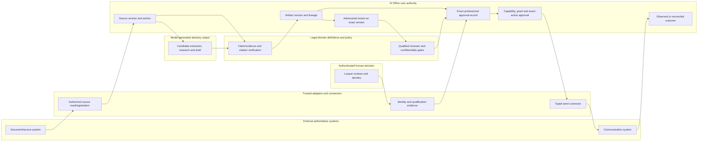

# M15-2 — Legal design probe

Status: design probe, 2026-10-02. This synthetic scenario tests the
[M15-1 shared boundary](m15-shared-professional-model.md); it is not a legal
service, jurisdictional policy, connector specification or production pilot.

## Scenario and authority

A lawyer's team prepares a response to a contractual dispute. Intake receives
an executed agreement revision `A-3` and an email export `E-7`. An agent
extracts a candidate proposition about a notice date. The email contradicts
the initial reading, so the proposition remains disputed until a person
resolves it. A draft response is revised after independent review. A qualified
lawyer approves the exact final draft before a controlled send operation.

One AI Office `Project` owns the tasks, runs, policy and audit. `Matter M-42`,
parties, legal issue, deadline and professional role definitions are legal
domain records. The document system and communication system remain sources of
their own content and delivery outcomes. The project need not have a repository
or coding client. The Runtime, rather than a prompt or role name, enforces
scope, transitions and approvals in the target design; legal matter scope and
qualified-human identity are not current Runtime capabilities.

| Stage                 | Input and output                                                                                                                            | Required authority or check                                                                                                                                        |
| --------------------- | ------------------------------------------------------------------------------------------------------------------------------------------- | ------------------------------------------------------------------------------------------------------------------------------------------------------------------ |
| Intake                | Register `A-3` and `E-7` with connector ID, revision/fingerprint, matter scope and classification.                                          | Authorized read scope; no document body in audit or logs.                                                                                                          |
| Extraction            | Claim `C-1` links to `A-3` page 4 paragraph 2; contrary anchor links to `E-7` message 18. Producer run and extraction version are recorded. | `C-1` starts as alleged/disputed, never established by model confidence.                                                                                           |
| Research and draft    | Research sources have stable revisions and resolvable citation anchors; draft `D-1` records exact source/claim versions.                    | Missing or inaccessible citations block verification.                                                                                                              |
| Adversarial review    | Reviewer `R-1` challenges `C-1` and requests changes on fingerprint `D-1`.                                                                  | Reviewer identity is distinct from producer where policy requires independence. Findings do not approve a draft.                                                   |
| Correction            | A human resolves the contradictory source; draft `D-2` has a new fingerprint and lineage.                                                   | `R-1` is stale for `D-2`; repeat required checks on the new version.                                                                                               |
| Professional approval | Qualified human `H-1` reviews `D-2` and the source/citation report.                                                                         | Exact-version, matter-scoped approval with identity, qualification evidence, policy revision and timestamp. No inferred human presence.                            |
| Communication         | Controlled `send` intent targets an exact recipient, channel and `D-2` fingerprint.                                                         | Fresh grant, connector descriptor, recipient and document preconditions; separate exact-action approval when required. Record attempt and observed delivery state. |

The pipeline shape is intake → source registration → extraction → research →
draft → independent review → citation verification → human review/approval →
controlled communication. A changes-requested branch repeats draft and review
within a bounded loop. Today the sequential pipeline foundation exists, but
typed artifacts and bounded correction loops are future work; this probe does
not claim the pipeline is executable now.

## Data flow and authority boundaries

This is the target design flow. The boxes identify the owner of each decision;
they do not assert that source registration, artifact review, a send connector
or authenticated human presence is implemented today.

The authorized adapter registers a source version and anchor; legal checks
decide whether a candidate claim has adequate evidence. A model may propose a
claim or draft but cannot register a trusted source, establish truth, sign a
professional approval, grant a capability or invoke `send`/filing authority.
The lawyer's decision requires independently verified identity and
qualification evidence before the Runtime records an exact-version
professional approval. The controlled-action gateway then separately checks
the grant, recipient, descriptor, artifact fingerprint, required action
approval and current preconditions. A connector performs the one external
attempt; the communication system owns delivery facts, which AI Office records
as observed or explicitly unknown pending reconciliation. There is no
model-to-send or model-to-filing authority path.

## Failure probes

| Change or failure                                                                 | Expected Runtime decision                                                                                                  |
| --------------------------------------------------------------------------------- | -------------------------------------------------------------------------------------------------------------------------- |
| `D-2` changes after `H-1` approval                                                | Treat the approval as non-current; block send until the new fingerprint is reviewed and approved.                          |
| `A-3` is replaced by `A-4`, or a citation anchor cannot be resolved               | Flag dependent claims and pending draft for revalidation. Preserve history; do not silently substitute the new source.     |
| A model labels `C-1` “established” while contradictory evidence remains           | Retain the domain status assigned by authorized verification policy; block any transition that requires established facts. |
| A reviewer has a different role label but the same principal as the drafter       | Independent-review condition fails on stable identity.                                                                     |
| A valid lawyer approval exists but the matter grant or recipient constraint fails | Deny the controlled action. Professional approval confers no connector capability.                                         |
| Send times out after submission                                                   | Record an ambiguous/unknown outcome and reconcile with the communication system; do not resend automatically.              |
| Another matter references `M-42` source or audit content                          | Deny or redact at the project/matter access boundary and record an auditable denial without leaking content.               |

## Core boundary exercised

In the target design, core owns the exact source/artifact/version envelope, project ownership,
lineage, pipeline gates, stable actor identities, deny-by-default policy,
controlled-action lifecycle and audit. Legal definitions own matter/party/issue
vocabulary, evidence-state meanings, citation locator and verifier, lawyer
qualification rules, confidentiality/ethical-wall restrictions and connector
operation descriptors. A future legal package could contribute defaults; it
cannot grant authority.

The probe passes architecturally if `C-1` → `D-2` → `H-1` → send attempt is
queryable with exact source anchors and versions, and every failure above has a
deterministic denying or reconciliation state. The current product does not yet
meet that executable bar. A real pilot also needs jurisdiction-specific legal,
privacy, retention, identity, supervision and security assessment, including
authenticated human presence and matter isolation beyond the current
trusted-local same-user model.
